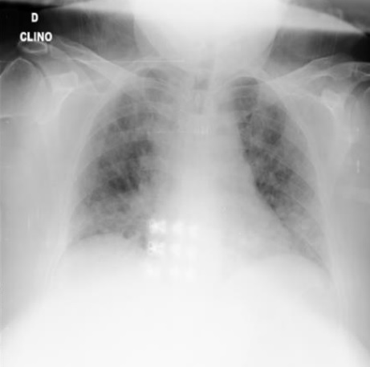
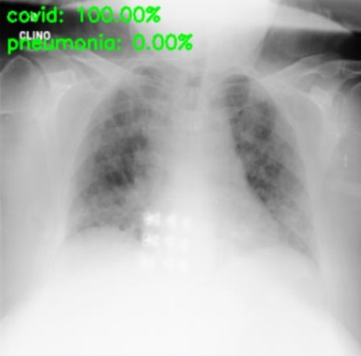
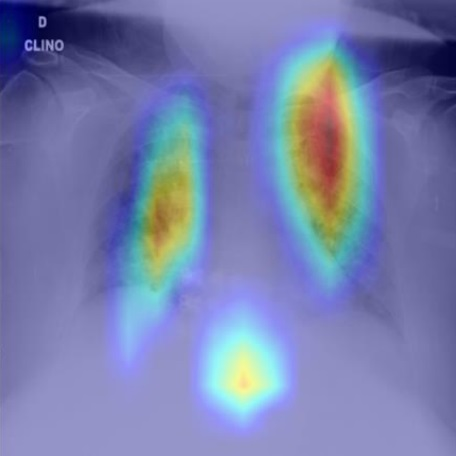
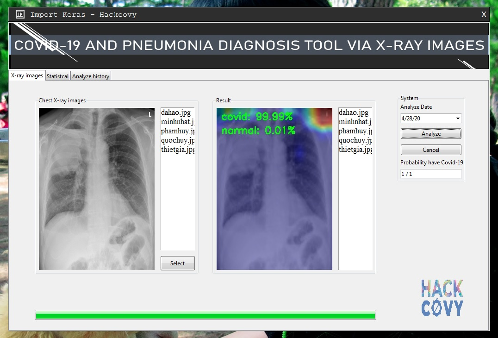
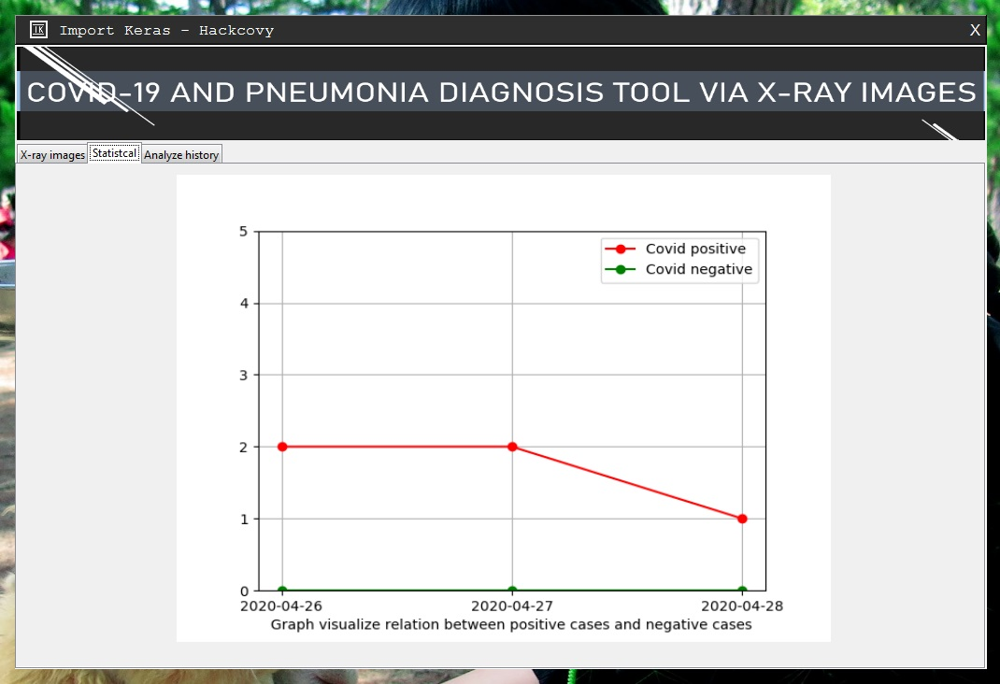
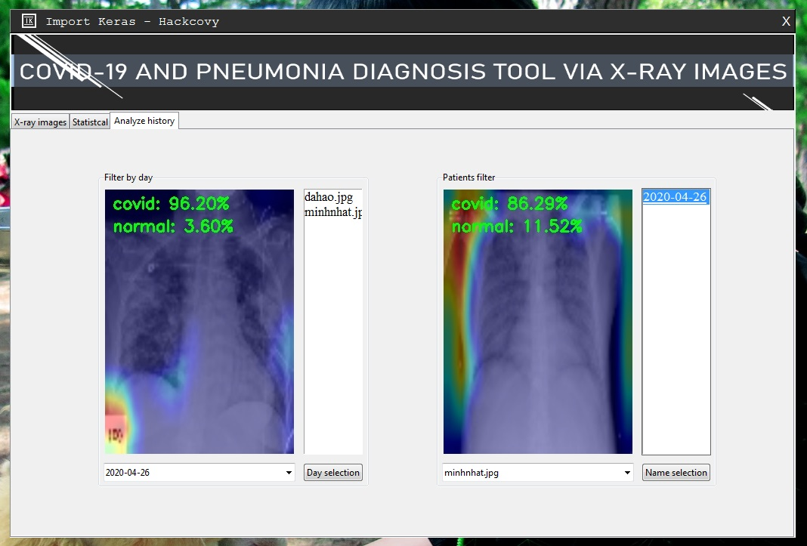

# [COVID-19 AND PNEUMONIA DIAGNOSIS TOOL VIA X-RAY IMAGES](https://drive.google.com/file/d/1WjqFcW9pShT29z72sz66JAAxUEPVGg9y/view?usp=sharing)
### A window program which can support doctor in diagnosing symtom of covid-19 by X-ray images.

<p float="left">
  
   
   
</p>

* [Screenshot](#screenshot)
* [Important Note](#important-note)
* [Requisites](#requisites)
* [Setup](#setup)
  * [Run code](#run-code)
* [References](#references)

## Screenshot





## Important Note

This repository is for reference only, so there may be errors, need to wait for a qualified physician to check, please do not rely on the program results to make health diagnosis.
  
## Requisites

* [Python 3.7.6](https://www.python.org/downloads/release/python-376/)

## Setup

First clone the repository:
```
git clone https://github.com/importkeras/hackcovy.git
```

Download 3 trained models (covid_1.pkl, covid_1.model, covid_new.model) and put to folder:
```
https://drive.google.com/drive/folders/1XkSnNqltwcW7DOT2nidVfmzIg3tV6sTQ?usp=sharing
```

Next, run the following command, which will install the required packages via
```
pip install -r requirements.txt
```

### Run code

The main and GUI code is in hackcovy.py.
To test whether the setup was successful, run the following command to use program GUI.
```
python hackcovy.py.
```

## References

This project builds from the work listed below:

* COVID-19 image data collection ([repo](https://github.com/ieee8023/covid-chestxray-dataset))
* Dr. Joseph Cohen and Chest x-ray dataset from Oxford
